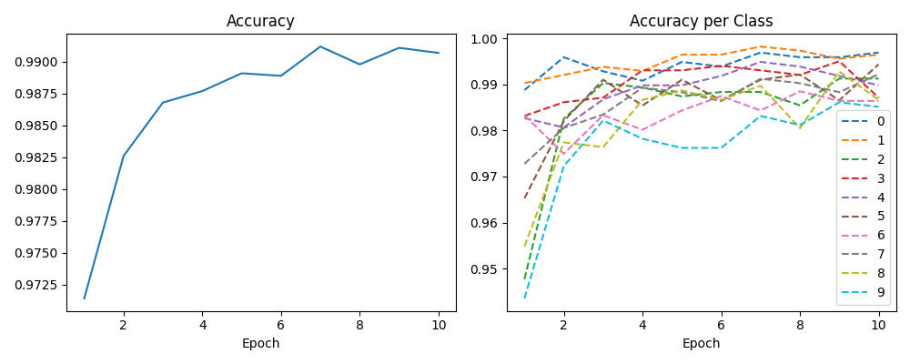
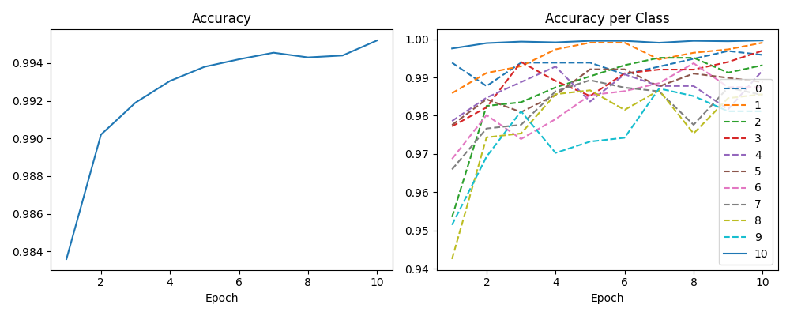

# CNN

<https://github.com/pytorch/examples/blob/main/mnist/main.py> をそのまま借りた

## MNIST

### パラメータ類

| not_number_train_size | not_number_test_size | train_size | test_size | batch_size | epochs | learning_rate |
| --- | --- | --- | --- | --- | --- | --- |
| 0 | 0 | 60000 | 10000 | 100 | 10 | 0.05 |

```txt
CNN(
  (conv1): Conv2d(1, 32, kernel_size=(3, 3), stride=(1, 1))
  (conv2): Conv2d(32, 64, kernel_size=(3, 3), stride=(1, 1))
  (dropout1): Dropout(p=0.25, inplace=False)
  (dropout2): Dropout(p=0.5, inplace=False)
  (fc1): Linear(in_features=9216, out_features=128, bias=True)
  (fc2): Linear(in_features=128, out_features=10, bias=True)
)
```

### 結果

```txt
Epoch  1, Test Loss: 0.0919, Correct: 9714/10000, Accuracy: 97.14%
Epoch  2, Test Loss: 0.0542, Correct: 9826/10000, Accuracy: 98.26%
Epoch  3, Test Loss: 0.0410, Correct: 9868/10000, Accuracy: 98.68%
Epoch  4, Test Loss: 0.0368, Correct: 9877/10000, Accuracy: 98.77%
Epoch  5, Test Loss: 0.0330, Correct: 9891/10000, Accuracy: 98.91%
Epoch  6, Test Loss: 0.0318, Correct: 9889/10000, Accuracy: 98.89%
Epoch  7, Test Loss: 0.0288, Correct: 9912/10000, Accuracy: 99.12%
Epoch  8, Test Loss: 0.0306, Correct: 9898/10000, Accuracy: 98.98%
Epoch  9, Test Loss: 0.0257, Correct: 9911/10000, Accuracy: 99.11%
Epoch 10, Test Loss: 0.0272, Correct: 9907/10000, Accuracy: 99.07%
Accuracy: 0: 99.69%, 1: 99.65%, 2: 99.13%, 3: 98.71%, 4: 98.98%, 5: 99.44%, 6: 98.64%, 7: 99.22%, 8: 98.67%, 9: 98.51%
```



かなり当たっててすごい。

## MNIST + 適当な画像(KMNIST, FashionMNISTの一部)

### パラメータ類

| not_number_train_size | not_number_test_size | train_size | test_size | batch_size | epochs | learning_rate |
| --- | --- | --- | --- | --- | --- | --- |
| 60000 | 10000 | 120000 | 20000 | 100 | 10 | 0.05 |

```txt
CNN(
  (conv1): Conv2d(1, 32, kernel_size=(3, 3), stride=(1, 1))
  (conv2): Conv2d(32, 64, kernel_size=(3, 3), stride=(1, 1))
  (dropout1): Dropout(p=0.25, inplace=False)
  (dropout2): Dropout(p=0.5, inplace=False)
  (fc1): Linear(in_features=9216, out_features=128, bias=True)
  (fc2): Linear(in_features=128, out_features=11, bias=True)
)
```

### 結果

```txt
Epoch  1, Test Loss: 0.0556, Correct: 19672/20000, Accuracy: 98.36%
Epoch  2, Test Loss: 0.0314, Correct: 19804/20000, Accuracy: 99.02%
Epoch  3, Test Loss: 0.0257, Correct: 19838/20000, Accuracy: 99.19%
Epoch  4, Test Loss: 0.0209, Correct: 19861/20000, Accuracy: 99.30%
Epoch  5, Test Loss: 0.0194, Correct: 19876/20000, Accuracy: 99.38%
Epoch  6, Test Loss: 0.0170, Correct: 19884/20000, Accuracy: 99.42%
Epoch  7, Test Loss: 0.0166, Correct: 19891/20000, Accuracy: 99.45%
Epoch  8, Test Loss: 0.0183, Correct: 19886/20000, Accuracy: 99.43%
Epoch  9, Test Loss: 0.0151, Correct: 19888/20000, Accuracy: 99.44%
Epoch 10, Test Loss: 0.0160, Correct: 19904/20000, Accuracy: 99.52%
Accuracy: 0: 99.59%, 1: 99.91%, 2: 99.32%, 3: 99.70%, 4: 99.19%, 5: 98.88%, 6: 98.75%, 7: 98.54%, 8: 98.56%, 9: 98.12%, 10: 99.97%
```



「10」が数字ではない画像。私の予想と反してかなり当たってる。MNISTだと簡単だったかな。ほかのデータセットでも試したい。
