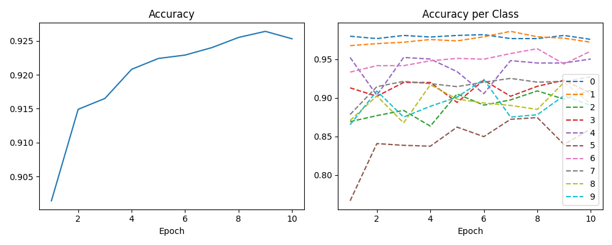
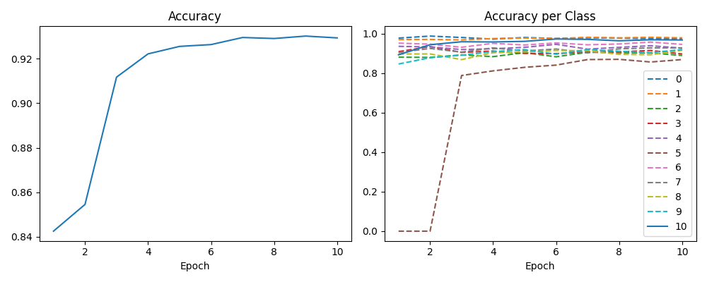

# 全結合

適当に組んだ。他のモデルでも大体同じように実験できるはず

## MNIST

### ネットワーク

```txt
SimpleFullConnectNet(
  (flatten): Flatten(start_dim=1, end_dim=-1)
  (in_layer): Linear(in_features=784, out_features=1000, bias=True)
  (fcs): ModuleList(
    (0): Linear(in_features=1000, out_features=100, bias=True)
    (1): Linear(in_features=100, out_features=500, bias=True)
  )
  (out_layer): Linear(in_features=500, out_features=10, bias=True)
)
```

### 結果

```txt
Epoch  1, Test Loss: 1.5743, Correct: 9014/10000, Accuracy: 90.14%
Epoch  2, Test Loss: 1.5542, Correct: 9149/10000, Accuracy: 91.49%
Epoch  3, Test Loss: 1.5488, Correct: 9165/10000, Accuracy: 91.65%
Epoch  4, Test Loss: 1.5447, Correct: 9208/10000, Accuracy: 92.08%
Epoch  5, Test Loss: 1.5415, Correct: 9224/10000, Accuracy: 92.24%
Epoch  6, Test Loss: 1.5420, Correct: 9229/10000, Accuracy: 92.29%
Epoch  7, Test Loss: 1.5400, Correct: 9240/10000, Accuracy: 92.40%
Epoch  8, Test Loss: 1.5380, Correct: 9255/10000, Accuracy: 92.55%
Epoch  9, Test Loss: 1.5368, Correct: 9264/10000, Accuracy: 92.64%
Epoch 10, Test Loss: 1.5378, Correct: 9253/10000, Accuracy: 92.53%
Accuracy: 0: 97.55%, 1: 97.18%, 2: 90.99%, 3: 90.59%, 4: 95.01%, 5: 85.99%, 6: 96.03%, 7: 92.70%, 8: 89.22%, 9: 89.00%
```



「5」が難しいっぽい

## MNIST + 適当な画像(KMNIST, FashionMNISTの一部)

### ネットワーク

```txt
SimpleFullConnectNet(
  (flatten): Flatten(start_dim=1, end_dim=-1)
  (in_layer): Linear(in_features=784, out_features=1000, bias=True)
  (fcs): ModuleList(
    (0): Linear(in_features=1000, out_features=100, bias=True)
    (1): Linear(in_features=100, out_features=500, bias=True)
  )
  (out_layer): Linear(in_features=500, out_features=11, bias=True)
)
```

### 結果

```txt
Epoch  1, Test Loss: 1.7111, Correct: 9268/11000, Accuracy: 84.25%
Epoch  2, Test Loss: 1.6941, Correct: 9400/11000, Accuracy: 85.45%
Epoch  3, Test Loss: 1.6398, Correct: 10029/11000, Accuracy: 91.17%
Epoch  4, Test Loss: 1.6270, Correct: 10144/11000, Accuracy: 92.22%
Epoch  5, Test Loss: 1.6224, Correct: 10181/11000, Accuracy: 92.55%
Epoch  6, Test Loss: 1.6204, Correct: 10190/11000, Accuracy: 92.64%
Epoch  7, Test Loss: 1.6179, Correct: 10225/11000, Accuracy: 92.95%
Epoch  8, Test Loss: 1.6168, Correct: 10220/11000, Accuracy: 92.91%
Epoch  9, Test Loss: 1.6148, Correct: 10232/11000, Accuracy: 93.02%
Epoch 10, Test Loss: 1.6162, Correct: 10223/11000, Accuracy: 92.94%
Accuracy: 0: 97.45%, 1: 97.89%, 2: 88.95%, 3: 89.70%, 4: 92.67%, 5: 86.88%, 6: 94.57%, 7: 92.80%, 8: 91.58%, 9: 91.97%, 10: 96.80%
```



「10」が数字ではない画像。割と当たってるけど、本物の数字の正解率が低いので検証の結果としてはふさわしくない
